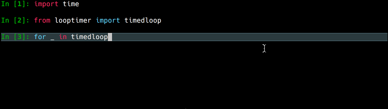

# looptimer

Progress bar style loop timer with projected time-to-completion.

[]()
[](https://pypi.python.org/pypi/looptimer)


## Installation
```pip install looptimer```

## Usage
Directly wrap any iterable with `timedloop` to get iteration progress status:

```python
from looptimer import timedloop

for _ in timedloop(range(100), label='foo'):
	...
```

### Sample output


### Optional arguments

Argument|Type|Default|Description
--------|----|-------|-----------
`label`|str|None|Descriptive label printed to the left of the progress bar
`bar_char`|str|▢|Character used to fill in the progress bar
`bar_width`|int|20|Character width of the progress bar
`animate`|bool|True|Disable to print each update on a new line (useful when interspersed with other log messages)
`max_refresh_secs`|float|0.1|Use to throttle print frequency for fast-iterating loops

